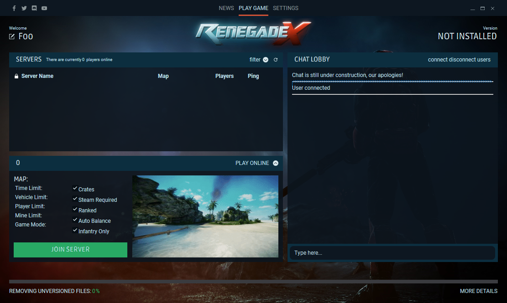

# RenegadeX Launcher

⚠ Note: The source code provided here is **NOT** the currently released Totem Arts launcher. ⚠



### Makes use of the following dependencies of the same developer (SonnyX):

[RenegadeX-patcher-lib](https://github.com/SonnyX/RenegadeX-patcher-lib)

[xDelta-decoder](https://github.com/SonnyX/xdelta-decoder-rust)

[Download-Async](https://github.com/SonnyX/download-async)

[UnZip](https://github.com/SonnyX/unzip-rs)

[RunAs](https://github.com/SonnyX/rust-runas)


## Front-end development tools
[sciter-js](https://github.com/c-smile/sciter-js-sdk/tree/main/bin/windows/x32) contains a few integral files for the development of sciter-related products (e.g. the launcher)
The important ones are: 
 - `sciter.dll` this file is used by the launcher to run the front-end.
 - `inspector.exe` this file can act like a dom-inspector (like `F12` in Chrome/Firefox), to use it, place `inspector.exe` inside of the pre-compiled launcher folder, and open `inspector.exe` along with `RenegadeX Launcher.exe`, press `ctrl+shift+i` or `ctrl+shift+left-click` to select an element.
 - `usciter.exe` this can open a htm(l) file and thus render things like sciter does, useful for development.

## Compilation Instructions
### Windows
Cross-Compiling relies on Docker, make sure to have it installed!
```bash
cargo install cross
```

To compile for windows:
```bash
./package-windows.sh
```

### Linux
Native build-requirements for Arch based systems:
```bash
sudo pacman -Syu cmake gcc pkgconf wget openssl
```

Build commands:
```bash
cargo update
cargo build --release
```

Run commands for Linux:
Download Sciter from `https://github.com/c-smile/sciter-js-sdk/` and add the path to `$SCITER_PATH`
```
export PATH=$PATH:$SCITER_PATH/bin/linux/x64
cargo run --release
```
